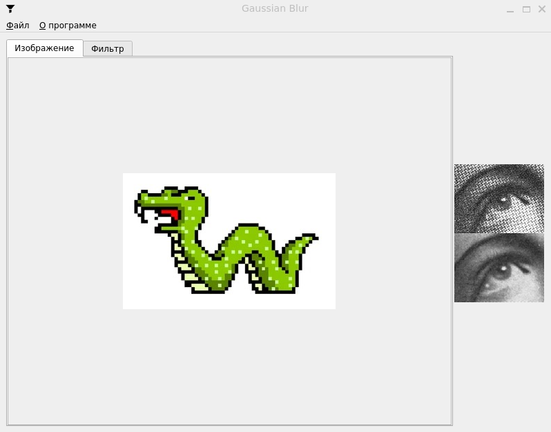

# Gaussian_Blur
Gaussian Blur Project

Needed - QT version 5 min  

  

  

## Table of Contents
1. [Project Description](#gaussian-blur-image-processor)
2. [Features](#features)
3. [Menu Structure](#menu-structure)
4. [Filter Tab](#filter-tab)
5. [Technologies Used](#technologies-used)
6. [Build Instructions](#build-instructions)
    - [Windows](#windows)
    - [Linux](#linux)
7. [Author](#author)

# Gaussian Blur Image Processor

A C++ application for applying Gaussian blur to images in BMP, JPG, or PNG formats (8 and 24 bits per pixel). Developed as a test assignment for the position of Software Engineer.

## Features

- Open, display, and process image files (BMP, JPG, PNG — 8/24 bpp).
- Apply Gaussian blur with a user-defined radius (2 to 20).
- Multithreaded processing with a modal progress dialog and cancel option.
- Persistent filter settings (saved and restored between sessions).
- Two-tab interface: **Image** and **Filter**.
- Scrollable views for large images.
- Resizable main window with fullscreen support.
- Cross-platform development using **Qt** and **CMake**.
- Object-oriented design principles.

## Menu Structure

- **File**
  - **Open…** — Opens a standard file dialog, loads and displays the image.
  - **Save…** — Saves the processed image (enabled only after processing).
  - **Exit** — Closes the application.

- **About**  
  Displays app information: name, version, and developer.

## Filter Tab

- Allows setting the Gaussian blur radius (2–20).
- Start button initiates the filter process in a separate thread.
- Modal progress dialog with cancel option.
- Automatically displays the last processed image when switching tabs.
- Remembers the filter radius between sessions.

## Technologies Used

- **C++17**
- **Qt 5** (Widgets, Multithreading, QSettings, QFileDialog)
- **CMake** (for cross-platform builds)
- **PowerShell Scripts** for build and cleanup automation (Windows)

## Build Instructions

### Windows
1. Clone the repository:
   ```bash
   git clone ... (insert .git link here)
   cd gaussian_blur

2. Build:
   ```bash
   .\build.ps1

3. Run:
   ```bash
   .\run.ps1

4. Clean:
   ```bash
   .\clean.ps1

### Linux
1. Clone the repository:
   ```bash
   git clone ... (insert .git link here)
   cd gaussian_blur

2. Build:
   ```bash
   chmod +x ./build_linux.sh
   ./build_linux.sh

3. Run:
   ```bash
   chmod +x ./run_linux.sh
   ./run_linux.sh

4. Clean:
   ```bash
   chmod +x ./clean_linux.sh
   ./clean_linux.sh

## Author
- [Anton Evgenev](https://t.me/tdutanton)
